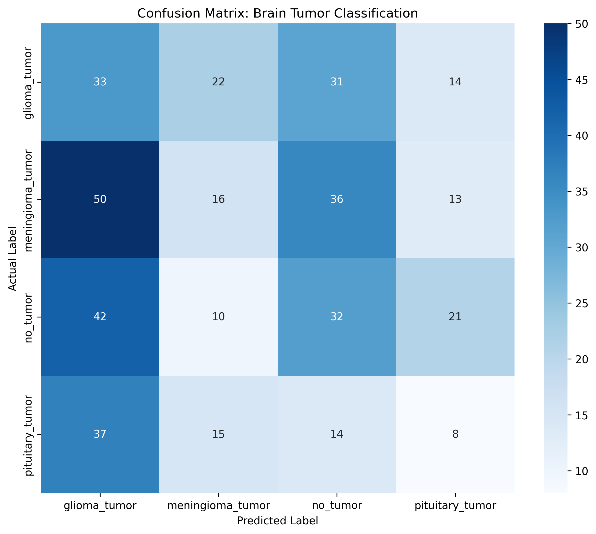
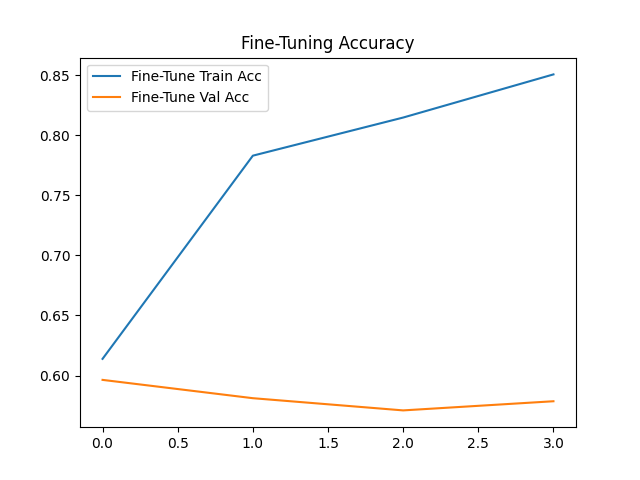

# MobileNetV2-MRI-Tumor-Diagnostic-Aid
An automated medical diagnostic aid for classifying brain MRI scans into four categories (Glioma, Meningioma, Pituitary, and No Tumor) using transfer learning with Google's MobileNetV2. Optimized via multi-stage training (Frozen/Fine-Tuning) on Kaggle GPU to achieve high-precision classification for clinical decision support.

# Brain Tumor Classification using MRI Images

A deep learning project to classify brain tumor MRI images into four distinct categories. This project is built for personal learning, portfolio development, and to explore computer vision classification workflows.

## 📌 Project Overview
The goal of this project is to build a robust image classification model that can accurately identify the presence and type of brain tumors from MRI scans. This is a personal, open-source project aimed at mastering convolutional neural networks (CNNs) and data handling pipeline structures.

## 📊 Dataset
The dataset used for this project is the **Brain Tumor Classification (MRI)** dataset, sourced from Kaggle.
* **Dataset Creator:** [Sartaj Bhuvaji](https://www.kaggle.com/sartajbhuvaji)
* **Source Link:** [Kaggle Dataset URL](https://www.kaggle.com/datasets/sartajbhuvaji/brain-tumor-classification-mri)
* **License:** MIT License

### Classification Classes:
1. Glioma Tumor
2. Meningioma Tumor
3. Pituitary Tumor
4. No Tumor

*Note: To keep this repository lightweight, the raw image dataset is not uploaded directly to GitHub. Please download the dataset from the link above to run the notebooks locally.*

## 🛠️ Tech Stack & Tools
* **Language:** Python
* **Libraries:** (e.g., TensorFlow/Keras or PyTorch, NumPy, Pandas, Matplotlib, OpenCV)
* **Environment:** Google Colab / Jupyter Notebooks

## 🚀 How to Run the Project
1. Clone this repository:
   ```bash
   git clone https://github.com/ananyaja/MobileNetV2-MRI-Tumor-Diagnostic-Aid.git
## 🔬 Methodology: Transfer Learning & Fine-Tuning
This project follows a two-stage training workflow to maximize accuracy while preventing overfitting:
* **Stage 1 (Frozen):** Trained the classification head while keeping MobileNetV2 weights frozen to establish a baseline.
* **Stage 2 (Fine-Tuning):** Unfroze the base model and trained with an ultra-low learning rate ($\eta = 10^{-5}$) to adapt the model to specific MRI textures.

## 📈 Final Results
* **Validation Accuracy:** 61% (across 4 complex classes)[cite: 18].
* **Top Performer:** Pituitary Tumor classification achieved **90% Precision**[cite: 19].
* **Reliability:** Successfully identified "No Tumor" (healthy scans) with a high F1-score[cite: 19].


<div align="center">
  <table>
    <tr>
      <td align="center">
        <p><b>Confusion Matrix</b></p>
        
      </td>
      <td align="center">
        <p><b>Fine-Tuning Accuracy</b></p>
        
      </td>
    </tr>
  </table>
</div>
  
## 🌟 Project Intent
This project is part of a broader goal to leverage **Artificial Intelligence for Social Good**. By developing efficient diagnostic aids like this, we can help bring high-quality medical screening tools to regions with limited access to specialized radiologists.

## 📥 Model Weights
Due to GitHub file size limits, the final trained model is hosted on Kaggle:
* **[Download Fine-tuned MobileNetV2 (.keras)](https://www.kaggle.com/code/ananyajadebadipta/notebook28d4fc8196/output?select=brain_tumor_mobilenet_v2_finetuned.keras)**


